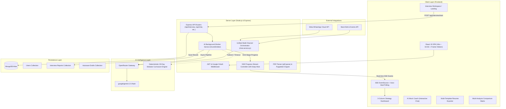

# Prepnex AI

<div align="center">
  
  <h2>Prepnex AI — Intelligent Career & Technical Interview Workspace</h2>
  <p><strong>Transform your technical interview preparation with AI-powered ATS resume optimization, dynamic 1–30 day preparation roadmaps, mock interview coaching, and cross-channel intelligence.</strong></p>

  <p>
    <a href="#-features"></a>
    <a href="#-technology-stack"></a>
    <a href="#-ai-engine--architecture"></a>
    <a href="#-license"></a>
  </p>
</div>

---

## 📑 Table of Contents

- [Overview](#-overview)
- [System Architecture](#-system-architecture)
- [Key Features](#-key-features)
  - [1. Real-Time AI Generation Pipeline & Streaming](#1-real-time-ai-generation-pipeline--streaming)
  - [2. Dynamic 1–30 Days Roadmap Engine](#2-dynamic-130-days-roadmap-engine)
  - [3. In-Depth ATS Resume Analysis & Scoring](#3-in-depth-ats-resume-analysis--scoring)
  - [4. AI Mock Interview Coach](#4-ai-mock-interview-coach)
  - [5. ATS Resume Re-writer & Multi-Template PDF Exporter](#5-ats-resume-re-writer--multi-template-pdf-exporter)
  - [6. Multi-Analysis Comparison Tool](#6-multi-analysis-comparison-tool)
  - [7. Analytics Dashboard & Gamified Streak Tracking](#7-analytics-dashboard--gamified-streak-tracking)
  - [8. Real-Time Cloud Autosave & Draft Restoration](#8-real-time-cloud-autosave--draft-restoration)
  - [9. Omnichannel Chatbot (WhatsApp, Slack & Web)](#9-omnichannel-chatbot-whatsapp-slack--web)
- [Project Directory Structure](#-project-directory-structure)
- [Technology Stack](#-technology-stack)
- [Getting Started & Local Setup](#-getting-started--local-setup)
  - [Prerequisites](#prerequisites)
  - [Installation](#1-installation)
  - [Environment Variables](#2-environment-variables)
  - [Running the Application](#3-running-the-application)
- [API Reference](#-api-reference)
- [Multi-Channel Bot Setup](#-multi-channel-bot-setup)
  - [Meta WhatsApp Cloud API](#meta-whatsapp-cloud-api)
  - [Slack Bolt & Events API](#slack-bolt--events-api)
- [Production Deployment](#-production-deployment)
- [Troubleshooting & FAQs](#-troubleshooting--faqs)
- [License](#-license)

---

## 🌟 Overview

**Prepnex AI** is an end-to-end, full-stack career acceleration platform designed to eliminate the guesswork from technical interview preparation. Candidates face high friction tailoring resumes, identifying technical blindspots, structuring daily revision schedules, and practicing behavioral responses.

Prepnex AI ingests target **Job Descriptions** alongside candidate **PDF Resumes** or profiles, executing concurrent semantic analysis via high-throughput LLMs (`google/gemini-2.5-flash` via OpenRouter). It produces:
- A personalized, pedagogical **1–30 day study plan** with interactive task tracking and curated technical documentation.
- High-probability **technical, behavioral (STAR), and system design questions** with evaluation intent.
- An **ATS Compatibility Breakdown** with keyword matching and actionable recruiter feedback.
- A fully rewritten, **ATS-compliant 1-page resume** ready for instant multi-template PDF export (Classic, Modern, Microsoft formats).
- An interactive **AI Mock Interview Coach** for interactive conversational practice.

---

## 🏗 System Architecture



---

## 🚀 Key Features

### 1. Real-Time AI Generation Pipeline & Streaming
- **Concurrent Multi-Stage Execution**: Rather than blocking sequentially, the backend worker executes ATS Analysis & Questions concurrently, followed by Roadmap generation and Resume Rewriting.
- **Server-Sent Events (SSE)**: Streams granular progress for each pipeline stage (`ats`, `questions`, `roadmap`, `rewrite`, `complete`) directly to the browser.
- **Cinematic Glassmorphic Overlay**: Displays glowing radial status badges and live checkmarks for parsed stages.
- **Zero-Hang Auto-Heal Protection**: Equipped with 15-second heartbeat keep-alives, socket flush delays, and automated frontend polling fallbacks that auto-resolve if the connection drops or finalizes.

### 2. Dynamic 1–30 Days Roadmap Engine
- **Customizable Sprint Duration**: Choose any preparation timeframe from **1 to 30 days**.
- **Pedagogical Day-by-Day Progression**:
  - **Day 1**: Core system architecture, technology fundamentals, and critical skill gap remediation.
  - **Intermediate Days**: Distributed systems, composite indexing, multi-tier caching (Redis), API security (OAuth 2.0 / JWT), microservices, containerization (Docker / K8s), and algorithmic patterns.
  - **Penultimate Day**: End-to-end timed Mock System Design simulation.
  - **Final Day**: Behavioral STAR mastery, resume metric defense, and pre-interview mental readiness checklist.
- **Actionable Tasks with Resources**: Each day features focused morning/afternoon tasks with estimated study hours, difficulty ratings, priorities, and authoritative learning links (MDN, System Design Primer, LeetCode, Redis Docs).
- **Task Completion & Persistence**: Click to complete tasks; progress updates dynamically in local state and MongoDB.

### 3. In-Depth ATS Resume Analysis & Scoring
- **Automated Score Breakdown**: Visual radial indicators for **ATS Compatibility Score** (0–100) and **Role Match Score**.
- **Skill Gap Identification**: Categorized gap pills tagged with severity levels (`high`, `medium`, `low`).
- **Keyword Differential**: Clear comparison showing **Keywords Added** versus **Keywords Still Missing** from the target JD.
- **Direct Recruiter Feedback**: Clear, actionable executive critique on structural presentation, impact quantification, and domain depth.

### 4. AI Mock Interview Coach
- **Context-Aware Simulation**: Practice answering the tailored technical and behavioral questions generated for your role.
- **STAR Method Evaluation**: The coach analyzes candidate answers against Situation, Task, Action, and Result dimensions.
- **Intention Unveiling**: Explains the hidden psychological or architectural motivation behind every question.
- **Interactive Follow-ups**: Ask clarifying questions and request hints directly in the conversational coach drawer.

### 5. ATS Resume Re-writer & Multi-Template PDF Exporter
- **Automated Re-writing**: Rewrites candidate experience into metric-driven bullet points aligning with the JD without fabricating credentials.
- **Three Professional Templates**:
  - **Classic**: Traditional single-column layout favored by conservative hiring managers and top ATS parsers.
  - **Modern**: Clean, contemporary aesthetic with distinct typography and accent badges.
  - **Microsoft Style**: Elegant corporate layout with clear section borders and structured skill categories.
- **Direct PDF Export**: Generates client-side and server-side PDF downloads preserving strict 1-page margins and typography.

### 6. Multi-Analysis Comparison Tool
- **Side-by-Side Comparison**: Navigate to `/history/compare` to compare multiple past interview preparations side-by-side.
- **Comparative Metrics**: Compare ATS match scores, question difficulty distributions, skill gap overlap, and preparation progress across different companies or job applications.

### 7. Analytics Dashboard & Gamified Streak Tracking
- **Preparation Velocity**: Track completed tasks across all roadmaps.
- **Daily Streak Tracking**: Encourages consistent daily preparation with automated streak calculation.
- **Bookmarking & Search**: Favorite priority analyses, search past applications by job title or company name, and rename or delete reports.

### 8. Real-Time Cloud Autosave & Draft Restoration
- **Zero-Loss Input**: As you type your job description or self-description, drafts automatically debounce and persist to `/api/autosave`.
- **Session Continuity**: Switching tabs or accidentally refreshing the browser immediately restores the draft state.

### 9. Omnichannel Chatbot (WhatsApp, Slack & Web)
- **Central Conversational Orchestrator**: The backend `chat.service.js` powers conversational interactions across WhatsApp, Slack, and the web interface using the same unified AI brain.
- **Natural Language & Commands**: Supports commands such as `/analyze`, `/gaps`, `/plan`, `/quiz`, `/mock`, and `/ready`.

---

## 📂 Project Directory Structure

```
Prepnex-AI/
├── Backend/
│   ├── src/
│   │   ├── app.js                          # Express app configuration & middleware pipeline
│   │   ├── channels/                       # Multi-channel messaging adapters
│   │   │   ├── channelTypes.js             # Unified channel request/response schemas
│   │   │   ├── responseAdapter.js          # Web, Slack & WhatsApp response formatting
│   │   │   ├── webhookAuth.middleware.js   # HMAC signature verification for webhooks
│   │   │   ├── slack/                      # Slack Bolt & Events API adapter
│   │   │   └── whatsapp/                   # Meta WhatsApp Cloud API adapter
│   │   ├── config/                         # Environment & AI service configurations
│   │   │   ├── ai.config.js                # Model defaults & OpenRouter settings
│   │   │   ├── database.js                 # Mongoose MongoDB connection pooling
│   │   │   ├── env.js                      # Environment variable validation
│   │   │   └── openrouter.client.js        # OpenRouter API client wrapper
│   │   ├── controllers/                    # HTTP request handlers
│   │   │   ├── activity.controller.js      # User activity logging & metrics
│   │   │   ├── auth.controller.js          # Authentication & Google OAuth
│   │   │   ├── autosave.controller.js      # Input draft autosave
│   │   │   ├── history.controller.js       # Past analysis queries & compare
│   │   │   ├── interview.controller.js     # Interview report lifecycle & SSE streaming
│   │   │   └── roadmap.controller.js       # Task toggle & roadmap progress
│   │   ├── middlewares/                    # Custom middleware functions
│   │   │   ├── auth.middleware.js          # JWT token verification (HS256)
│   │   │   ├── error.middleware.js         # Centralized error handler
│   │   │   └── file.middleware.js          # Multer memory storage & PDF-only filter
│   │   ├── models/                         # Mongoose data schemas
│   │   │   ├── achievement.model.js        # User achievements & badges
│   │   │   ├── activity.model.js           # User activity stream
│   │   │   ├── autosave.model.js           # Draft schema
│   │   │   ├── blacklist.model.js          # Revoked tokens with TTL index
│   │   │   ├── channelUser.model.js        # Cross-channel identity mapping
│   │   │   ├── conversation.model.js       # Chat sessions & history
│   │   │   ├── interviewReport.model.js    # Comprehensive interview report schema
│   │   │   ├── resume.model.js             # Extracted resume profile
│   │   │   ├── resumeVersion.model.js      # Versioned resume schema
│   │   │   ├── roadmapProgress.model.js    # Task completion progress
│   │   │   └── user.model.js               # User accounts schema
│   │   ├── routes/                         # Express route definitions
│   │   │   ├── activity.routes.js          # /api/activity
│   │   │   ├── auth.routes.js              # /api/auth
│   │   │   ├── autosave.routes.js          # /api/autosave
│   │   │   ├── chat.routes.js              # /api/chat
│   │   │   ├── history.routes.js           # /api/history
│   │   │   ├── interview.routes.js         # /api/interview
│   │   │   └── roadmap.routes.js           # /api/roadmap
│   │   ├── services/                       # Core domain business logic
│   │   │   ├── ai.service.js               # OpenRouter API prompts, schemas & 30-day fallback
│   │   │   ├── aiWorker.service.js         # Background worker queue & SSE event emitter
│   │   │   ├── chat.service.js             # Conversational chatbot orchestrator
│   │   │   └── resumeBuilder.service.js    # HTML resume compilation
│   │   └── utils/                          # Shared helpers & handlers
│   │       └── asyncHandler.js             # Async controller wrapper
│   ├── test/                               # Automated regression test suite
│   │   ├── cache_and_scoring.test.js       # Bounded cache, TTL & zero scoring tests
│   │   ├── controllers.test.js             # Authorization & schema alignment tests
│   │   ├── roadmap.test.js                 # 1-30 day roadmap generation tests
│   │   └── security.test.js                # Multer PDF filter, JWT & index tests
│   ├── render.yaml                         # Render deployment blueprint
│   ├── server.js                           # Node HTTP server entry point
│   ├── slack-bot.js                        # Dedicated Slack SocketMode runner
│   └── package.json
│
├── Frontend/
│   ├── public/                             # Static assets & routing redirects
│   │   ├── _redirects                      # Netlify/Cloudflare SPA rewrite rule
│   │   └── favicon.ico
│   ├── src/
│   │   ├── components/                     # Reusable layout & UI components
│   │   │   ├── Navbar.jsx                  # Top navigation bar
│   │   │   ├── NotFound.jsx                # 404 error page
│   │   │   ├── PageLoader.jsx              # Suspense loading screen
│   │   │   └── PageWrapper.jsx             # Animated page transitions
│   │   ├── features/                       # Modular feature domains
│   │   │   ├── auth/                       # Authentication feature
│   │   │   │   ├── auth.context.jsx        # Auth state context
│   │   │   │   ├── components/Protected.jsx# Route guard
│   │   │   │   └── pages/Login.jsx         # Sign-in & OAuth page
│   │   │   ├── history/                    # Past analyses feature
│   │   │   │   ├── pages/History.jsx       # History list view
│   │   │   │   └── pages/CompareAnalyses.jsx # Side-by-side comparison matrix
│   │   │   ├── interview/                  # Main analysis feature
│   │   │   │   ├── components/             # Subcomponents (AI Coach, Q&A cards, etc.)
│   │   │   │   ├── hooks/                  # useInterview, useInterviewStream, useRoadmapProgress
│   │   │   │   ├── interview.context.jsx   # Active interview report context
│   │   │   │   ├── pages/Intro.jsx         # Marketing landing page
│   │   │   │   ├── pages/InterviewLanding.jsx # New report submission workspace
│   │   │   │   └── pages/Interview.jsx     # Full strategy dashboard & 3-column workspace
│   │   │   └── resume/                     # Resume preview & PDF export
│   │   │       ├── pdf/                    # PDF generation engine
│   │   │       │   └── templates/          # classic.js, modern.js, microsoft.js
│   │   │       └── pages/Resume.jsx        # Resume viewer
│   │   ├── layouts/DashboardLayout.jsx     # Master application shell
│   │   ├── app.routes.jsx                  # React Router configuration
│   │   ├── App.jsx                         # Main app root
│   │   ├── main.jsx                        # React 19 DOM entry point
│   │   └── style.scss                      # Global variables, themes & mixins
│   ├── index.html
│   ├── vite.config.js                      # Vite bundle configuration
│   └── package.json
│
└── README.md                               # Project documentation
```

---

## 🛠️ Technology Stack

| Layer | Technologies |
|---|---|
| **Frontend** | React 19, Vite 7, React Router 7, Framer Motion, Sass (SCSS), Lucide Icons, html2canvas, jsPDF, DOMPurify |
| **Backend** | Node.js (v20+), Express.js 5, Multer, pdf-parse, Puppeteer, Zod, zod-to-json-schema |
| **AI Intelligence** | OpenRouter API (`google/gemini-2.5-flash`), custom deterministic 30-day curriculum fallback engine |
| **Database** | MongoDB Atlas, Mongoose ODM |
| **Authentication** | JSON Web Tokens (JWT), Google Identity Services (`@react-oauth/google`), bcryptjs |
| **Integrations** | Slack Bolt SDK (Events API + Slash Commands), Meta WhatsApp Cloud API |

---

## ⚙️ Getting Started & Local Setup

### Prerequisites
- **Node.js**: v18.0.0 or higher (v20 LTS recommended).
- **npm**: v9.0.0 or higher.
- **MongoDB**: A running local instance or a free [MongoDB Atlas](https://www.mongodb.com/cloud/atlas) cluster URI.
- **OpenRouter API Key**: Obtainable from [openrouter.ai](https://openrouter.ai/keys) with access to `google/gemini-2.5-flash`.
- **Google OAuth Client ID**: (Optional for local development, required for Google login) from [Google Cloud Console](https://console.cloud.google.com/).

---

### 1. Installation

```bash
# 1. Clone the repository
git clone https://github.com/SidduKutchula/Prepnex-AI.git
cd Prepnex-AI

# 2. Install backend dependencies
cd Backend
npm install

# 3. Install frontend dependencies
cd ../Frontend
npm install
```

---

### 2. Environment Variables

Create `.env` files in both `Backend` and `Frontend` directories:

#### Backend: `Backend/.env`
```env
# Server Configuration
PORT=5000
NODE_ENV=development
CLIENT_URL=http://localhost:5173

# Database
MONGO_URI=mongodb+srv://<username>:<password>@cluster0.mongodb.net/prepnex-ai?retryWrites=true&w=majority

# Authentication
JWT_SECRET=your_super_secret_jwt_key_here_min_32_chars
GOOGLE_CLIENT_ID=your_google_client_id_here.apps.googleusercontent.com

# AI Gateway (OpenRouter)
OPENROUTER_API_KEY=sk-or-v1-your_openrouter_api_key_here
OPENROUTER_MODEL=google/gemini-2.5-flash

# (Optional) WhatsApp Cloud API Webhook Integration
WHATSAPP_ACCESS_TOKEN=your_meta_system_user_token
WHATSAPP_PHONE_NUMBER_ID=your_whatsapp_phone_number_id
WHATSAPP_APP_SECRET=your_meta_app_secret
WHATSAPP_VERIFY_TOKEN=your_custom_webhook_verify_string

# (Optional) Slack Bot Integration
SLACK_BOT_TOKEN=xoxb-your_slack_bot_token
SLACK_SIGNING_SECRET=your_slack_signing_secret
```

#### Frontend: `Frontend/.env`
```env
# API Endpoint
VITE_API_URL=http://localhost:5000

# Google OAuth Integration
VITE_GOOGLE_CLIENT_ID=your_google_client_id_here.apps.googleusercontent.com
```

---

### 3. Running the Application

Open two separate terminals:

**Terminal 1 — Backend API Server:**
```bash
cd Backend
npm run dev
# Server will start on http://localhost:5000
```

**Terminal 2 — Frontend Development Server:**
```bash
cd Frontend
npm run dev
# Frontend will start on http://localhost:5173
```

Navigate to `http://localhost:5173` in your browser.

---

## 📡 API Reference

### Authentication Routes (`/api/auth`)
| Method | Endpoint | Description | Auth Required |
|---|---|---|---|
| `POST` | `/api/auth/register` | Register a new user with username, email, and password | No |
| `POST` | `/api/auth/login` | Login with email and password, returns JWT token | No |
| `POST` | `/api/auth/google` | Authenticate with Google ID token credential | No |
| `GET` | `/api/auth/me` | Fetch authenticated user profile | Yes (Bearer) |

### Interview & Analysis Routes (`/api/interview`)
| Method | Endpoint | Description | Auth Required |
|---|---|---|---|
| `POST` | `/api/interview/parse` | Parse uploaded PDF resume and extract raw text via `pdf-parse` | Yes (Bearer) |
| `POST` | `/api/interview/start` | Initialize background AI generation pipeline for a new report | Yes (Bearer) |
| `GET` | `/api/interview/stream/:interviewId` | Open SSE connection to stream generation progress in real-time | Yes (Token param) |
| `GET` | `/api/interview/report/:interviewId` | Retrieve full interview strategy report by ID | Yes (Bearer) |
| `GET` | `/api/interview/` | Get all interview reports belonging to the current user | Yes (Bearer) |
| `PUT` | `/api/interview/:interviewId/bookmark` | Toggle favorite / bookmarked status on an analysis | Yes (Bearer) |
| `PUT` | `/api/interview/:interviewId/rename` | Rename an interview analysis title | Yes (Bearer) |
| `DELETE` | `/api/interview/:interviewId` | Delete an interview analysis report | Yes (Bearer) |
| `PUT` | `/api/interview/:interviewId/task/:taskId/toggle` | Toggle task completion status (`completed`/`pending`) | Yes (Bearer) |
| `DELETE` | `/api/interview/:interviewId/roadmap/reset` | Reset all roadmap tasks back to pending state | Yes (Bearer) |
| `GET` | `/api/interview/analytics/dashboard` | Fetch global stats (completed tasks, streaks, total analyses) | Yes (Bearer) |

### Draft & Autosave Routes (`/api/autosave`)
| Method | Endpoint | Description | Auth Required |
|---|---|---|---|
| `POST` | `/api/autosave/save` | Debounced autosave for active inputs (JD, resume text, days) | Yes (Bearer) |
| `GET` | `/api/autosave/load` | Retrieve user's last unsaved workspace draft | Yes (Bearer) |
| `DELETE` | `/api/autosave/clear` | Clear saved draft upon report generation | Yes (Bearer) |

### Chat & Webhooks (`/api/chat` & `/webhooks`)
| Method | Endpoint | Description | Auth Required |
|---|---|---|---|
| `POST` | `/api/chat/message` | Conversational interview chatbot interface | Yes (Bearer) |
| `GET` | `/webhooks/whatsapp` | Meta WhatsApp webhook verification endpoint | No |
| `POST` | `/webhooks/whatsapp` | Handle incoming WhatsApp messages | No |
| `POST` | `/webhooks/slack` | Handle Slack Events API and Slash commands | No |

---

## 🤖 Multi-Channel Bot Setup

### Meta WhatsApp Cloud API
1. Create an application in the [Meta for Developers Console](https://developers.facebook.com/) and configure the **WhatsApp** product.
2. In **WhatsApp > Configuration**:
   - Set **Callback URL** to `https://<your-server-domain>/webhooks/whatsapp`.
   - Set **Verify Token** to your custom string configured in `WHATSAPP_VERIFY_TOKEN`.
   - Subscribe to the `messages` event.
3. Configure `WHATSAPP_ACCESS_TOKEN`, `WHATSAPP_PHONE_NUMBER_ID`, and `WHATSAPP_APP_SECRET` in `Backend/.env`.

### Slack Bolt & Events API
1. Create a Slack App in the [Slack API Dashboard](https://api.slack.com/apps).
2. Under **OAuth & Permissions**, add bot scopes:
   `chat:write`, `im:history`, `im:read`, `app_mentions:read`, `files:read`.
3. Under **Event Subscriptions**:
   - Enable Events and set **Request URL** to `https://<your-server-domain>/webhooks/slack`.
   - Add workspace event subscriptions: `message.im` and `app_mention`.
4. (Optional) Create slash commands like `/prepnex`, `/analyze`, or `/plan` pointing to `https://<your-server-domain>/webhooks/slack`.
5. Install the app to your workspace and populate `SLACK_BOT_TOKEN` and `SLACK_SIGNING_SECRET` in `Backend/.env`.

---

## 🚀 Production Deployment

### Frontend (Vercel / Cloudflare Pages / Netlify)
The frontend builds into optimized static assets.
- **Build Command**: `npm run build`
- **Output Directory**: `dist`
- **SPA Routing**: The repository includes `Frontend/public/_redirects` and `Frontend/vercel.json` to handle client-side route rewrites so direct navigation to `/interview/:id` or `/history` works seamlessly.

### Backend (Render / Railway / AWS / Docker)
The repository includes a ready-to-use `Backend/render.yaml` blueprint:
- **Build Command**: `npm install`
- **Start Command**: `node server.js`
- **Environment Variables**: Make sure to set `CLIENT_URL` to your production frontend URL (e.g. `https://prepnex.ai`) to allow CORS headers.

---

## 🔧 Troubleshooting & FAQs

#### Q: The report generation gets stuck on "Finalizing Report".
> **Resolution**: This issue is resolved in the latest version. The backend now uses a clean socket flush delay and a 15-second heartbeat ping on the SSE connection. Additionally, the frontend features an automatic polling safety net (`useInterviewStream`) that checks report completion every 2.5 seconds and transitions out of the loading overlay if all 4 generation stages are ready.

#### Q: Can I specify a preparation roadmap longer than 7 days?
> **Resolution**: Yes! The preparation duration input accepts any sprint length between **1 and 30 days**. The AI prompt dynamically allocates tasks according to the exact day count requested, and the backend fallback curriculum contains a full 30-day modular curriculum.

#### Q: PDF generation fails when downloading ATS Resumes.
> **Resolution**: Client-side export utilizes `html2canvas` and `jsPDF`. Ensure your browser does not block popups and that third-party ad-blockers are disabled for the application domain.

#### Q: OpenRouter returns a 401 or 404 error.
> **Resolution**: Ensure that `OPENROUTER_API_KEY` is present in `Backend/.env`. If using a custom model, check that `OPENROUTER_MODEL` is set to a valid model ID (default: `google/gemini-2.5-flash`).

---

## 📄 License

This project is proprietary and confidential. All rights reserved &copy; Prepnex AI.
